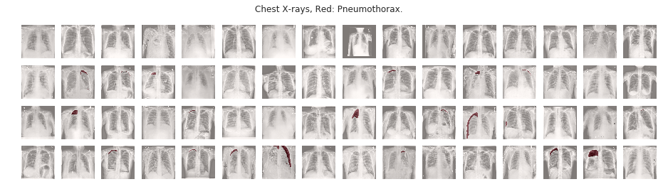
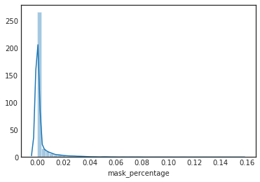

## Kaggle SIIM-ACR Pneumothorax Segmentation Challenge

Pneumothorax can be caused by a blunt chest injury, damage from underlying lung disease, or most horrifying—it may occur for no obvious reason at all. On some occasions, a collapsed lung can be a life-threatening event.

Pneumothorax is usually diagnosed by a radiologist on a chest x-ray, and can sometimes be very difficult to confirm. An accurate AI algorithm to detect pneumothorax would be useful in a lot of clinical scenarios. AI could be used to triage chest radiographs for priority interpretation, or to provide a more confident diagnosis for non-radiologists.

In this competition we are given a set of images and associated masks. An image can have multiple instances of Pneumothorax and the aim is to segment each instance separately. 

Around 2100 images are positive cases of pneumothorax. Further, the region occupied by pneumothorax is very small. The vast number of negative samples and the paucity of positive cases of pneumothorax makes the challenge difficult.

I will keep updating the kernel as I explore further.

